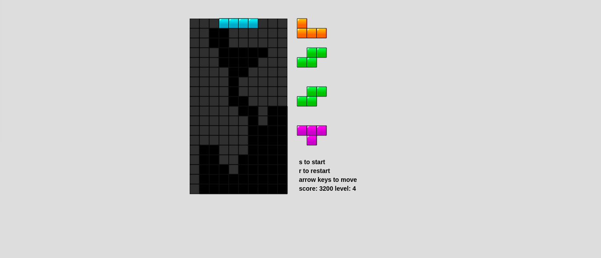

# Tetris2.0

[Tetris](https://forestturner.github.io)

This is a javascript game to a replica of tetris.

Instructions: Use arrow keys to move, s to start and r to reset.

## Technologies used

1. Vanilla Javascript - for game logic
2. HTML5 Canvas - for visual components

## MVP Features:

1) Tetris block fall, and build up. When a row is completely full, destroy the row. See incoming tetris blocks.



2) Score is kept. 100 per line or 800 for a tetris.

3) Works like tetris..

4) As levels increase so does the speed.

```
run(){
  this.stage = new createjs.Stage(this.canvas);
  this.background();
  this.setTetris();
  this.nextTetrisBlock = Math.floor(Math.random()*7);
  this.renderTetris();
  createjs.Ticker.setFPS(100);
  createjs.Ticker.addEventListener("tick",this.stage);
  this.stage.update();
  let _this = this;
  window.addEventListener('keydown',_this.onkeydown);
```

To do:
- Add another game type where the game is circular.
- Add multiple skins for pieces.
- Add cool leveling up and combo animations.
